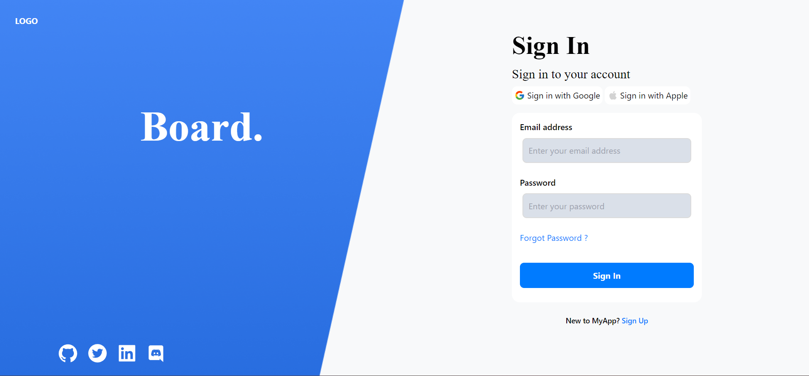
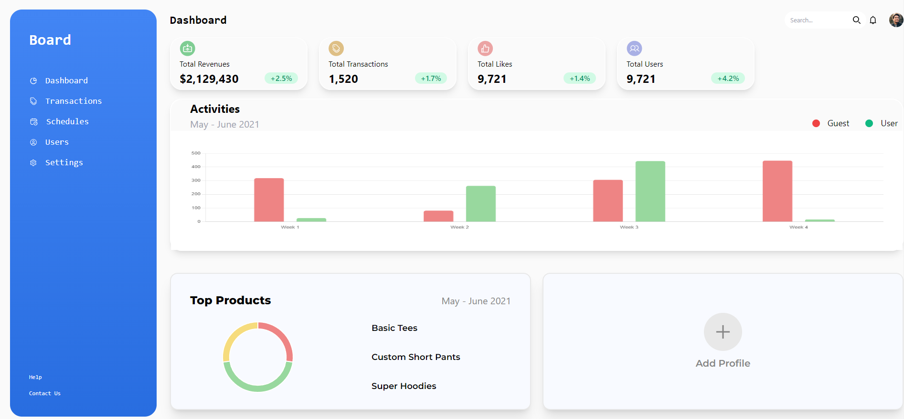
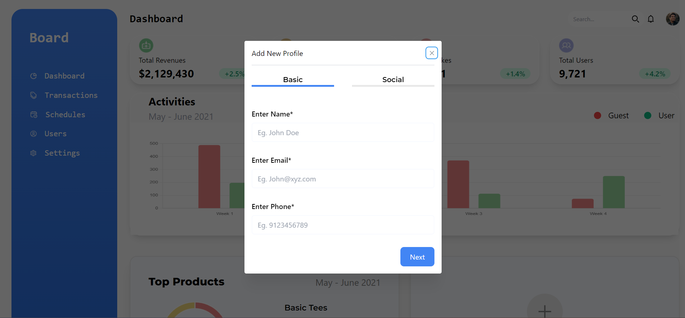
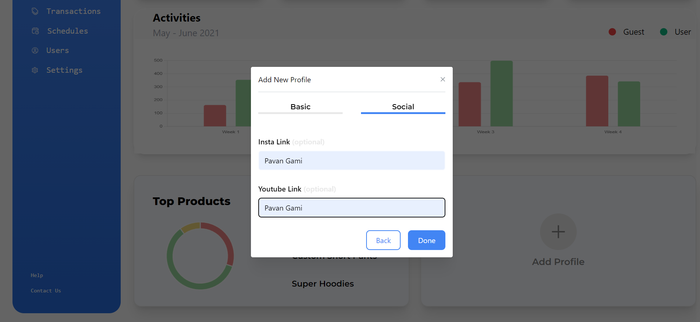
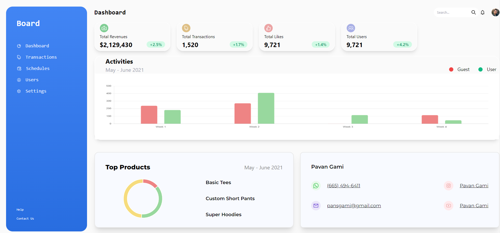

# Dashboard App

The Dashboard app is a web application developed using the React JavaScript library and Firebase, a comprehensive cloud-based platform for building web and mobile applications.

## Available on this Site

Runs the app in the development mode.\
Open [https://dashboard-app-15-9-23.netlify.app/](https://dashboard-app-15-9-23.netlify.app/) to view it in your browser.

- Features:
- User Authentication: The app typically offers secure user authentication using Firebase Authentication, allowing users to sign up, log in, and protect sensitive data through identity verification.
- Data Visualization: Users can view data in various formats such as charts, graphs, tables, or custom visualizations. React is used to dynamically update the user interface as data changes in real-time.
- Responsive Design: The app is typically designed to be responsive, ensuring it works seamlessly across various devices and screen sizes.

Overall, the Dashboard app created using React and Firebase combines the power of a modern front-end library (React) with a robust back-end and cloud infrastructure (Firebase) to deliver a user-friendly, real-time, and data-driven platform for data management, visualization, and decision-making. It can be customized and extended to meet specific business or organizational needs, making it a versatile tool for a wide range of industries and use cases.
